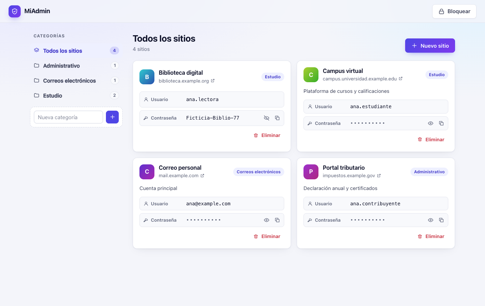
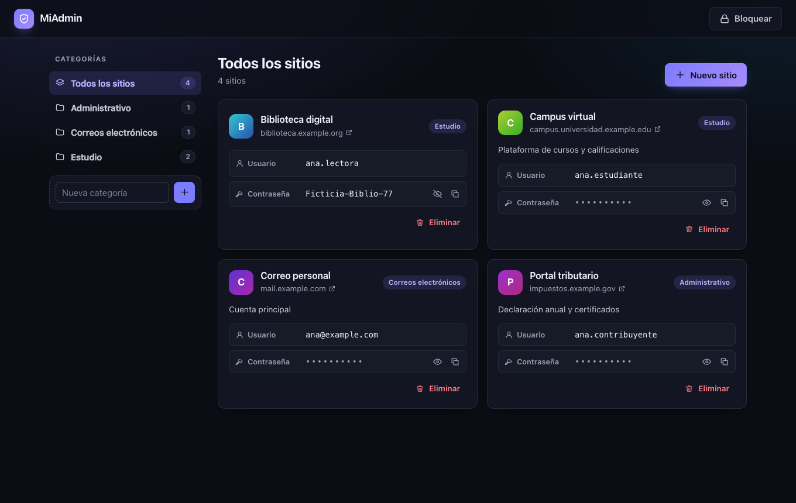
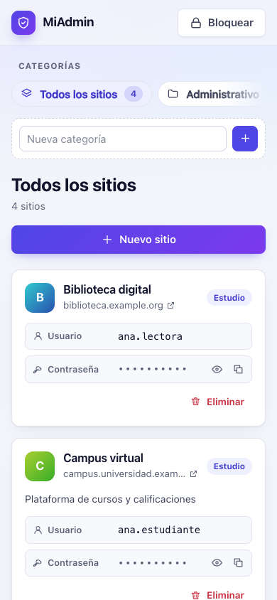

# MiAdmin

Bóveda personal de accesos a sitios web que funciona íntegramente en el navegador: las contraseñas se cifran con tu clave maestra (PBKDF2 + AES-GCM, WebCrypto) y nunca se guardan en claro.



| Modo oscuro | Móvil |
|---|---|
|  |  |

Es el proyecto piloto con el que se validó la metodología [Software AI Development](https://github.com/alex7506/software-ai-development) y su herramienta `ai-dev`.

## Uso
```bash
npm ci
npm run dev        # desarrollo
npm run build && npm run preview
```

## Calidad
```bash
npm run typecheck && npm test && npm audit --audit-level=high
ai-dev validate && ai-dev trace --git
```

Documentación del proyecto (requisitos, arquitectura, decisiones, tareas, validación y release): `docs/`. Estado: `ai-dev status`.
